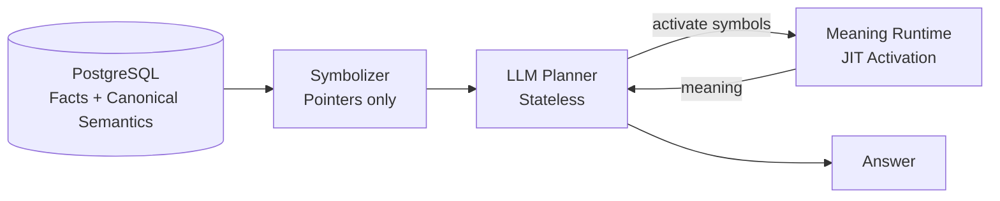

# JIT Symbolic Memory Architecture for LLMs

> Stateless semantic memory effect for LLM systems  
> PostgreSQL · Symbols · Just-In-Time Meaning · Ollama / LLaMA

---

## Why this exists

Large Language Models do not have memory in the traditional sense.  
Attempts to give them one usually fail by:

- storing interpretations instead of facts  
- polluting context windows  
- creating hidden, drifting state  
- mixing probabilistic reasoning with deterministic storage  

This architecture takes the opposite approach:

LLMs should not store meaning.  
They should be given a reason to compute it again — exactly when needed.

---

## Core Idea

This system produces a memory effect without memory by separating concerns strictly:

**PostgreSQL → Symbols → JIT Meaning Activation → LLM Reasoning**

- SQL stores facts and canonical semantics
- Symbols act as pointers, not meaning containers
- Meaning is computed just-in-time, never stored
- LLM remains stateless and honest

---

## Architecture Overview

### 1. Ground Truth Layer (PostgreSQL)

Stores:
- Facts
- Events
- Entities
- Canonical semantics (types, tags, ontology keys)

Never stores:
- Contextual meaning
- Interpretations
- Runtime relevance
- Conclusions

**Rule:**  
SQL = truth, not thought

---

### 2. Symbol Layer (Pointer Interface)

A Symbol is a lightweight reference:

```text
Symbol = { kind, ref, payload }
```

- `kind` → domain type (event, entity, etc.)
- `ref` → stable identifier (SQL primary key)
- `payload` → minimal semantic metadata (not meaning)

**Important:**

- Symbols do not contain meaning
- Symbols trigger meaning activation

This is the shared language between SQL and LLM.

---

### 3. Canonical Semantics (Stored)

SQL does carry semantics — but only in a stable form.

Examples:
- type labels
- tags
- roles
- ontology references
- static relationships

**Rule:**  
Stored semantics = what something is  
Computed meaning = why it matters now

---

### 4. Meaning Runtime (Just-In-Time)

Meaning is a runtime event, not a stored object.

Activation flow:
1. LLM sees symbols only
2. LLM selects which symbols to activate (budgeted)
3. Runtime fetches facts + semantics from SQL
4. Meaning is computed in this moment
5. Meaning may be discarded immediately

Optional:
- per-session cache
- TTL
- priority weighting

Meaning never flows back into storage.

---

### 5. Planner → Activator → Answer Loop

**Plan:**
- LLM receives symbols only
- Chooses which symbols to activate
- Operates under a strict budget

**Activate:**
- Only requested symbols are resolved
- Meaning is computed JIT

**Answer:**
- LLM answers using activated meanings only
- No hidden access to the database

This prevents:
- hallucinations
- semantic drift
- context poisoning

---

## Why This Works

- No memory corruption (no persistent cognitive state)
- No stale meaning (always recomputed)
- No SQL–LLM impedance mismatch
- Context becomes a resource, not a liability

---

## What This Is NOT

- Vector database memory
- Classical RAG
- Long-term conversational memory
- Agent personality storage

---

## Correct Terminology

Avoid calling this “LLM memory”.

Correct terms:
- Just-In-Time Semantic Activation
- Stateless Semantic Memory Effect
- Symbolic Runtime Reasoning Architecture

---

## One-Line Rule

**Store semantics.**  
**Compute meaning.**  
**Never confuse the two.**

---

## Architecture Diagram (Mermaid)



---

## A Small ASCII Moment

```
            z z z
          __________
         |          |
         |  neural  |
         |  weights |
         |__________|
              ||
              ||
          .----++----.
         |   WAKE UP  |
         |   compute  |
         |  meaning!  |
          '------------'
              ||
        [ symbols arrive ]
              ||
        ( no memory harmed )
```

---

## License and Usage

### License Classes

This architecture is **not free to use by default**.

Two license classes exist:

1. **One Pizza License (OPL)** — private and internal use only  
2. **Commercial / Enterprise License** — service-based or external use

---

### One Pizza License (OPL) — Scope

OPL permits **private and internal use only**, including:
- personal projects
- internal research and development
- internal tooling
- non-hosted, single-organization deployments

OPL explicitly **does NOT permit**:
- SaaS or hosted services
- APIs offered to external users
- enterprise platforms
- client-delivered systems
- multi-tenant environments
- revenue-generating services
- sublicensing or resale

Any use where the architecture is part of a **service offered to others**
requires a **separate commercial or enterprise license**.

---

### One Pizza License (OPL) — Fee Definition

- One-time payment
- One (1) pizza per end user
- The pizza price is defined as the **average retail price of a standard pizza**
  in the country where the end user is physically located at the time of payment
- No recurring fees

**Reference definition**

“Average pizza price” means a reasonable market average
(e.g. a common restaurant or delivery pizza, not premium or specialty pricing)
within that country.

A good-faith estimate is sufficient.
Exact pricing precision is not required.

---

### Payment & Proof

- Network: Cronos (EVM)
- Token: any Cronos-supported token
- Address:

0xAddc61aF05ACc594623c3e73D242C17d169A28b2

A confirmed on-chain transaction is sufficient proof of payment.
No registration or reporting is required.

---

### Commercial / Enterprise Licensing

Any use where the architecture is:
- embedded in a product
- offered as a service
- deployed for clients
- used in enterprise or multi-tenant systems

requires a **separate commercial or enterprise license**.

OPL does not apply.

---

### Attribution

All public use must include attribution to the original author
and a reference to the original document or repository.

---

## Closing Statement

JIT Symbolic Memory does not make models smarter.

It makes systems **honest about what they are actually doing**.
